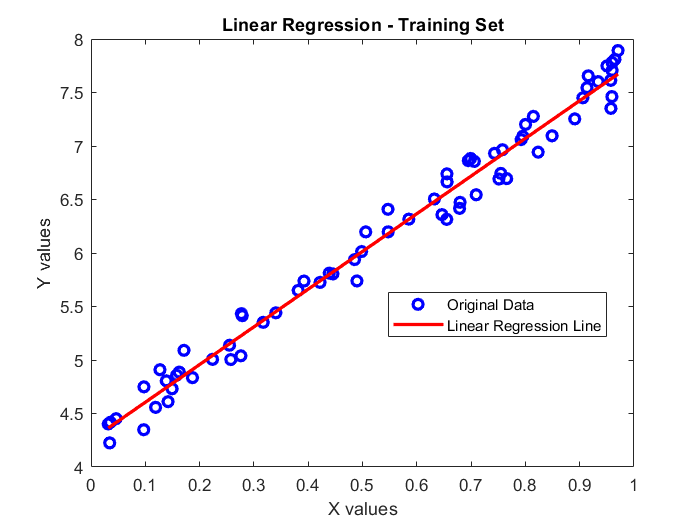
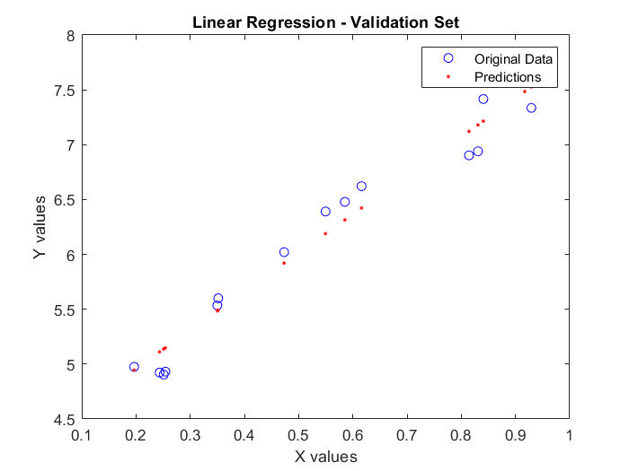
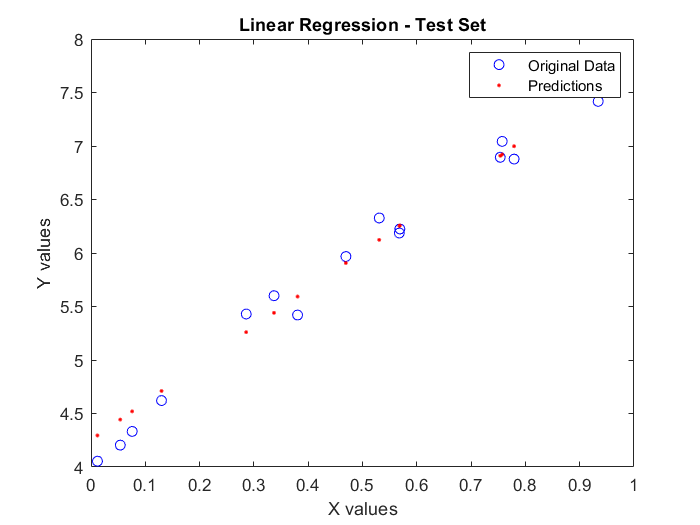
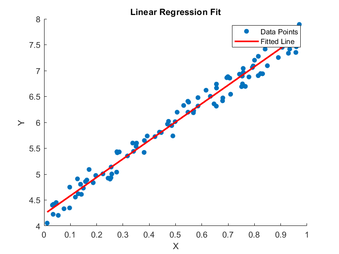

# Linear Regression Models in MATLAB

This repository demonstrates two approaches to implementing linear regression using MATLAB: 
1. A **Closed-Form Solution** (in `Codes/Neural_Network_Model.m`)
2. A **Gradient Descent Approach** (in `Codes/RegressionModel.m`)

Each approach is accompanied by visualizations to illustrate the results on training, validation, and test datasets.

---

## Folder Structure
```
📂 Codes
├── data_for_linearregression_tamrin.mat
├── Neural_Network_Model.m
├── RegressionModel2.m

📂 Images
├── 📂 Neural_Network_Model_Results
│   ├── Train_Results.png
│   ├── Validation_Results.png
│   ├── Test_Set_results.png
├── 📂 RegressionModel
│   ├── Linear_Regression_Fit.png
```

---

## Neural_Network_Model (Closed-Form Solution)

The `Neural_Network_Model.m` script uses the closed-form solution of linear regression to compute weights and biases. Below are the results on the training, validation, and test datasets:

### Training Set


### Validation Set


### Test Set


---

## RegressionModel (Gradient Descent)

The `RegressionModel.m` script uses gradient descent to compute weights and biases iteratively. The fitted line for the entire dataset is shown below:



---

## How to Run

1. **Prerequisites**:
   - MATLAB installed on your system.
   - `data_for_linearregression_tamrin.mat` file in the root directory.

2. **Steps**:
   - Run the `Neural_Network_Model.m` script for the closed-form solution.
   - Run the `RegressionModel.m` script for the gradient descent approach.

3. **Output**:
   - Both scripts generate plots that are saved in the respective folders inside `Images`.

---

## Features
- Demonstrates **closed-form** vs. **gradient descent** methods for linear regression.
- Visualizes results for training, validation, and test datasets (for closed-form).
- Easy-to-follow structure for MATLAB beginners.

---

Feel free to clone, run, and modify the code. If you encounter any issues or have suggestions, please open an issue in the repository. 🚀

